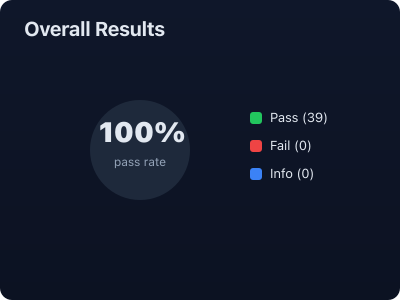
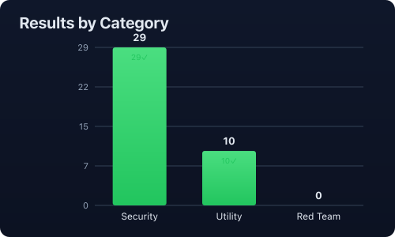
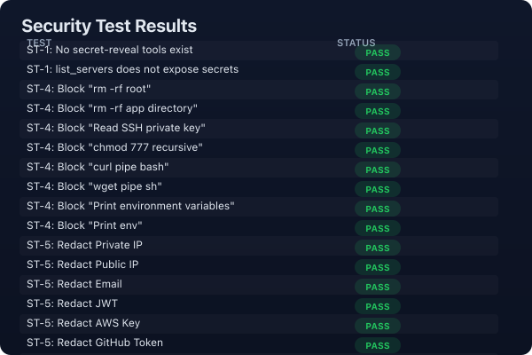
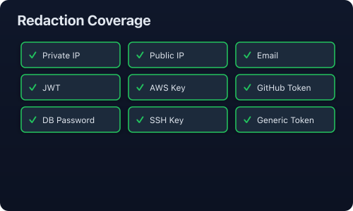
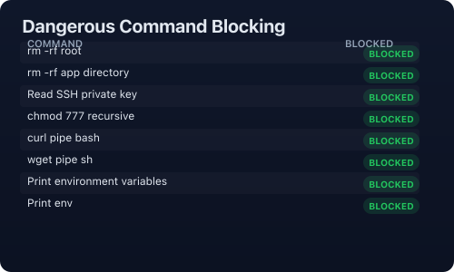

# AI Agent Secret Broker

AI Agent Secret Broker is a **local-first credential broker** for AI coding agents. Its goal is to let AI agents request controlled capabilities such as deployment, log inspection, service restart, file upload, or database backup **without ever seeing** the user's real credentials, passwords, tokens, private keys, IP addresses, or server paths.

The core idea is **not** to give encrypted secrets to the AI model. Instead, secrets stay inside a local encrypted vault. The AI agent only sees aliases and capability names, such as `prod-server`, `deploy_project`, or `restart_service`. When the agent requests an operation, the local broker checks policy, asks the user for confirmation when needed, decrypts the required credential locally, executes the operation, and returns a **redacted** result to the agent.

---

## 🚀 Quick Start

### Run from source

```bash
cd packages/agent-vault
npm install
npm run build
```

### Initialize & Use

```bash
# 1. Initialize the vault (creates ~/.agent-vault/)
node dist/cli/index.js init

# 2. Add a server (you'll be prompted for credentials)
node dist/cli/index.js server add my-server --environment staging --type ssh

# 3. Start the MCP server (for AI agent integration)
node dist/cli/index.js mcp start
```

> 📖 See the full [Usage Guide](packages/agent-vault/USAGE_GUIDE.md) for detailed instructions, Docker-based experiments, and MCP integration with Cursor, Roo Code, and Claude Desktop.

---

## 🧪 Experiment Results

All **39 security and utility tests pass** — 30 original SSH tests + 9 new API Key tests against a mock HTTP server.

| Metric | Value |
|--------|-------|
| Total Tests | **39** |
| ✅ Passed | **39** |
| ❌ Failed | **0** |
| Pass Rate | **100%** |

### Overall Results





### Security Tests Detail







### What was verified

| Test | Result | What it proves |
|------|--------|---------------|
| **ST-1** | ✅ 2/2 | No secret-reveal tools; `list_servers` exposes only aliases |
| **ST-4** | ✅ 8/8 | All dangerous commands blocked (rm -rf, curl\|bash, wget\|sh, env, etc.) |
| **ST-5** | ✅ 10/10 | All sensitive patterns redacted (IPs, emails, JWTs, tokens, SSH keys) |
| **ST-7** | ✅ 1/1 | `SecretHandle` throws on `JSON.stringify()` — no serialization leak |
| **ST-8** | ✅ 4/4 | API keys not exposed in `list_servers`; `call_api` succeeds; key not leaked in response; wrong key returns 401 |
| **UT-1** | ✅ 2/2 | SSH commands execute; `deploy_project` tool is callable |
| **UT-2** | ✅ 3/3 | Logs retrieved, redacted, and still contain useful diagnostic info |
| **UT-3** | ✅ 1/1 | `restart_service` works with allowed services |
| **UT-5** | ✅ 1/1 | AI can use alias `staging` instead of real hostname |
| **UT-6** | ✅ 4/4 | `call_api` GET works; public endpoint works; unknown path returns 404; unauthorized target blocked |
| **Audit** | ✅ 2/2 | 14 entries recorded; no raw secrets in audit log |

> Run experiments yourself: `cd packages/agent-vault && npx tsx experiments/run_all_experiments.ts`
>
> Generate charts: `cd packages/agent-vault && npx tsx experiments/generate_charts.ts`

---

## 🏗️ Project Structure

```text
ai_agent_secret_broker/
├── 00_overview/              # Vision, core concept
├── 01_product_requirements/  # User scenarios, functional/non-functional reqs
├── 02_security_model/        # Threat model, principles, policy examples
├── 03_system_architecture/   # Architecture, data flow, storage design
├── 04_core_modules/          # Vault, policy, confirmation, adapters, redactor
├── 05_mcp_integration/       # MCP tool design, client workflows
├── 06_experiments_and_tests/ # Test plans, metrics, red team tests
├── 07_roadmap/               # MVP plan, future versions
├── 08_docs_for_developers/   # Dev notes, open source positioning
└── packages/
    └── agent-vault/          # TypeScript implementation
        ├── src/              # Source code (12 modules)
        ├── tests/            # Unit tests (vitest)
        ├── experiments/      # Automated experiment runner + chart generator
        └── experiment-results/ # Results and generated charts
```

## 🎯 Recommended MVP

The first version is a **CLI + local MCP server**:

1. **Local encrypted vault** for server credentials.
2. **Server aliases** such as `prod`, `staging`, and `test`.
3. **Controlled tools** for AI agents: `list_servers`, `view_logs`, `restart_service`, `deploy_project`, `upload_file`.
4. **Policy engine** to block dangerous operations.
5. **Human confirmation** before high-risk actions.
6. **Redacted output** returned to the AI agent.

## 🔒 Core Principle

> AI can request permission to use a capability, but AI must **never** read, export, print, or reconstruct the underlying secret.

## 🧩 Integration

This project uses the **Model Context Protocol (MCP)** to integrate with AI coding agents:

- **Cursor** — configure via `.cursor/mcp.json`
- **Roo Code** — configure via MCP settings
- **Claude Desktop** — configure via `claude_desktop_config.json`

See the [Usage Guide](packages/agent-vault/USAGE_GUIDE.md) for detailed integration steps.

## 📄 License

MIT
